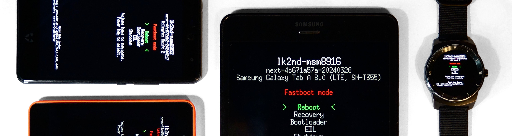

# lk2nd
lk2nd is a custom bootloader for many different devices based on Qualcomm
system-on-chips (SoCs), including smartphones, tablets, smartwatches and a few
single board computers (SBCs). It simplifies booting standard operating systems
by providing:

  - **A unified boot and flashing interface** (Android Fastboot), independent of
    device-specific modifications made to the boot chain (e.g. the proprietary
    flashing interface on Samsung devices)
  - **Automatic device and hardware detection** (e.g. display panels, batteries, ...)
  - **Additional bootloader features** (e.g. file system boot, booting from SD card)
  - **Additional firmware features** (e.g. booting secondary CPU cores if the firmware
    lacks [PSCI] support)
  - **Workarounds for various device-specific issues** (e.g. USB on some Samsung
    devices, modem on Motorola smartphones, ...)
  - **Various debugging commands** that allow better understanding of the hardware
    for research and development purposes

There are two different configurations:

  - **lk2nd:** "secondary" bootloader intended for devices where existing
    firmware cannot be replaced easily (most smartphones and tablets). In this
    configuration, lk2nd does **not** replace the stock bootloader. Instead, it
    is packed into an Android boot image, which is then loaded by the stock
    bootloader just like the original Android image.
    The real operating system can be placed in the boot partition with 512 KiB
    offset or stored in a ext2 file system. It does not have to be Android or
    even Linux, any kind of kernel can be packed into an Android boot image.

  - **lk1st:** primary bootloader intended for single-board computers (SBCs)
    and expert users. In this case, it is the "first" bootloader responsible for
    loading the main operating system.

This repository is a fork of the [original open-source bootloader from Qualcomm](https://git.codelinaro.org/clo/la/kernel/lk/-/tree/lk.lnx.1.0.r54-rel),
which is a heavily modified version of the [Little Kernel Embedded Operating System].

## Supported SoCs and devices

lk2nd supports a significant amount of devices. See [devices.md](Documentation/devices.md) for a comprehensive list.

## Installation
1. Download `lk2nd.img` (available in [Releases](https://github.com/msm8916-mainline/lk2nd/releases))
2. Flash `lk2nd.img` using the stock flashing interface:
    - Fastboot: `fastboot flash boot lk2nd.img`
    - Samsung: `heimdall flash --BOOT lk2nd.img`

If you get `fastboot: error: Couldn't parse partition size '0x'` try one of the following workarounds:

- `fastboot flash:raw boot lk2nd.img`
- `fastboot boot lk2nd.img`, then `fastboot flash lk2nd lk2nd.img`

## Usage
lk2nd provides the standard Android fastboot protocol for flashing/booting Android boot images.

Press `Volume Down` while booting to enter Fastboot mode.
Press `Volume Up` while booting to boot into Recovery mode.

> [!TIP]
> If your stock bootloader uses the same key combinations, you need to wait a bit before
> pressing the volume keys. Usually, waiting until the screen turns on and/or the device vibrates
> should be enough to make the stock bootloader ignore the keys.

`fastboot flash lk2nd lk2nd.img` can be used to update lk2nd directly from its
fastboot interface.

> [!IMPORTANT]
> `fastboot flash boot boot.img` will flash the actual boot image with 512 KiB offset
> into the boot partition. This is done to avoid replacing lk2nd (since it is also booted from
> the boot partition).

Other fastboot commands work normally.

### Troubleshooting
If the device shows up via fastboot you can get a log file from lk2nd using
`fastboot oem log && fastboot get_staged <output-file>`, where `<output-file>`
is either some text file to write to (e.g. `output.txt`) or `/dev/stdout` to
write the log to standard output.

## Building

Generally, this should be enough to build lk2nd:

```
$ make TOOLCHAIN_PREFIX=arm-none-eabi- lk2nd-msmXXXX
```

See [building.md](Documentation/building.md) for more info.

## Contact
Ask on [`#lk2nd:postmarketos.org`](https://matrix.to/#/#lk2nd:postmarketos.org) (`#lk2nd` on [irc.oftc.net](https://www.oftc.net/)).

[PSCI]: https://developer.arm.com/architectures/system-architectures/software-standards/psci
[Little Kernel Embedded Operating System]: https://github.com/littlekernel/lk

